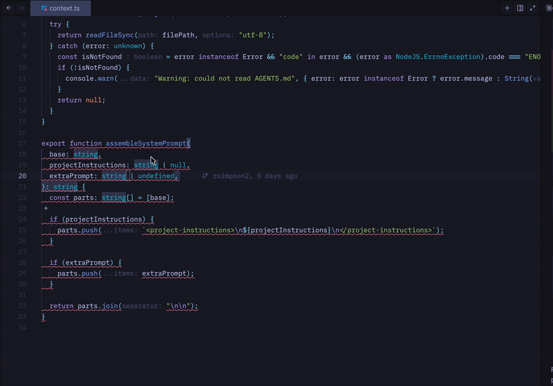

# eslint-plugin-llm-core

ESLint rules that catch the patterns LLM agents get wrong — and teach them to self-correct through structured error messages.

LLMs generate code that _works_ but drifts: arrow functions everywhere, magic numbers, deep nesting, string-interpolated logs, oversized files. These aren't style nitpicks — they compound into codebases that are harder to debug, review, and maintain.

This plugin catches those patterns at lint time and provides error messages designed for LLM comprehension: **what's wrong**, **why it matters**, and **a concrete fix**. The result is AI-generated code that reads like it was written by a senior engineer.



## Why this plugin?

- **Targeted rules** — Every rule addresses a real pattern LLMs consistently get wrong, from `export const fn = () => {}` to `logger.error(\`Failed for ${userId}\`)`
- **Teaching error messages** — Structured feedback that LLMs parse and apply correctly on the first attempt
- **Works for humans too** — These are solid code quality rules regardless of who wrote the code
- **Zero config** — The `recommended` preset is ready out of the box
- **Suggestions, not auto-fixes** — Transformations that could change semantics are offered as suggestions, keeping you in control

## How It Works

This plugin is designed around three principles that make it effective for LLM-assisted development:

### Deterministic Feedback

Every rule produces the **exact same error message for the same mistake**, every time. There is no randomness, no varying phrasing, no context-dependent rewording. This consistency means LLMs receive unambiguous signals about what to fix and how.

### Instructional Error Messages

Every error message follows a structured teaching format:

1. **What's wrong** — the specific violation
2. **Why it matters** — the rationale behind the rule
3. **How to fix** — a concrete, copy-pasteable transformation using the actual code context (function names, parameter lists, etc.)

```
Exported function 'fetchData' must use a function declaration, not a function expression or arrow function.

Why: Function declarations are hoisted, produce better stack traces, and signal clear intent.
Arrow functions are best reserved for callbacks and inline expressions, not top-level exports.

How to fix:
  Replace: export const fetchData = async () => { ... }
  With:    export async function fetchData() { ... }
```

This structure gives LLMs everything they need in one pass — the violation, the reasoning, and a concrete transformation. In practice, this reduces the back-and-forth iterations needed to resolve violations compared to standard ESLint messages.

### Strict Mode by Default

Both the `recommended` and `all` configs set every rule to `error`, not `warn`. Warnings are easy to ignore — for both humans and LLMs. Errors force the issue to be resolved before the code is accepted. Combined with the `no-inline-disable` rule (which prevents `// eslint-disable` escape hatches), this creates a feedback loop where the LLM **must** fix violations rather than suppress them.

## Installation

```bash
npm install eslint-plugin-llm-core --save-dev
```

## Quick Start

```js
// eslint.config.mjs
import llmCore from "eslint-plugin-llm-core";

export default [...llmCore.configs.recommended];
```

That's it. All recommended rules are now active.

### Available Configs

| Config        | Description                                     |
| ------------- | ----------------------------------------------- |
| `recommended` | Safe defaults — rules most codebases should use |
| `all`         | Every rule at `error` — for strict codebases    |

### Manual Rule Configuration

```js
// eslint.config.mjs
import llmCore from "eslint-plugin-llm-core";

export default [
  {
    plugins: {
      "llm-core": llmCore,
    },
    rules: {
      "llm-core/no-exported-function-expressions": "error",
      "llm-core/structured-logging": "error",
    },
  },
];
```

## Rules

<!-- begin auto-generated rules list -->

💼 Configurations enabled in.\
🌐 Set in the `all` configuration.\
✅ Set in the `recommended` configuration.\
💡 Manually fixable by [editor suggestions](https://eslint.org/docs/latest/use/core-concepts#rule-suggestions).

| Name                                                                               | Description                                                                                                  | 💼    | 💡  |
| :--------------------------------------------------------------------------------- | :----------------------------------------------------------------------------------------------------------- | :---- | :-- |
| [explicit-export-types](docs/rules/explicit-export-types.md)                       | Require explicit parameter and return type annotations on exported functions                                 | 🌐 ✅ |     |
| [filename-match-export](docs/rules/filename-match-export.md)                       | Enforce that filenames match their single exported function, class, or component name                        | 🌐 ✅ |     |
| [max-file-length](docs/rules/max-file-length.md)                                   | Enforce a maximum number of lines per file to encourage proper module separation                             | 🌐 ✅ |     |
| [max-function-length](docs/rules/max-function-length.md)                           | Enforce a maximum number of lines per function to encourage decomposition                                    | 🌐 ✅ |     |
| [max-nesting-depth](docs/rules/max-nesting-depth.md)                               | Enforce a maximum nesting depth for control flow statements to reduce cognitive complexity                   | 🌐 ✅ |     |
| [max-params](docs/rules/max-params.md)                                             | Enforce a maximum number of function parameters to encourage object parameter patterns                       | 🌐 ✅ |     |
| [naming-conventions](docs/rules/naming-conventions.md)                             | Enforce naming conventions: Base prefix for abstract classes, Error suffix for error classes                 | 🌐 ✅ |     |
| [no-any-in-generic](docs/rules/no-any-in-generic.md)                               | Disallow `any` as a generic type argument in type references, arrays, and other parameterized types          | 🌐 ✅ |     |
| [no-async-array-callbacks](docs/rules/no-async-array-callbacks.md)                 | Disallow async callbacks passed to array methods where Promises are silently discarded or misused            | 🌐 ✅ |     |
| [no-commented-out-code](docs/rules/no-commented-out-code.md)                       | Disallow commented-out code to keep the codebase clean and reduce noise                                      | 🌐 ✅ |     |
| [no-empty-catch](docs/rules/no-empty-catch.md)                                     | Disallow catch blocks with no meaningful error handling (empty or comment-only blocks)                       | 🌐 ✅ |     |
| [no-exported-function-expressions](docs/rules/no-exported-function-expressions.md) | Enforce that exported functions use function declarations instead of function expressions or arrow functions | 🌐 ✅ | 💡  |
| [no-inline-disable](docs/rules/no-inline-disable.md)                               | Disallow eslint-disable comments that suppress lint errors instead of fixing them                            | 🌐 ✅ |     |
| [no-magic-numbers](docs/rules/no-magic-numbers.md)                                 | Disallow magic numbers and enforce named constants for clarity                                               | 🌐 ✅ |     |
| [no-type-assertion-any](docs/rules/no-type-assertion-any.md)                       | Disallow type assertions to `any` that bypass TypeScript's type safety                                       | 🌐 ✅ |     |
| [prefer-early-return](docs/rules/prefer-early-return.md)                           | Enforce guard clauses (early returns) instead of wrapping function bodies in a single if statement           | 🌐 ✅ |     |
| [prefer-unknown-in-catch](docs/rules/prefer-unknown-in-catch.md)                   | Disallow `any` type annotation on catch clause parameters; prefer `unknown`                                  | 🌐 ✅ |     |
| [structured-logging](docs/rules/structured-logging.md)                             | Enforce structured logging with static messages and dynamic values as separate metadata                      | 🌐 ✅ |     |
| [throw-error-objects](docs/rules/throw-error-objects.md)                           | Disallow throwing non-Error values such as strings, template literals, plain objects, or arrays              | 🌐 ✅ |     |

<!-- end auto-generated rules list -->

## Research & Evidence

The rules in this plugin are grounded in empirical data from academic research on LLM coding errors. I actively monitor research to identify patterns that LLMs consistently get wrong.

Key papers that inform the ruleset:

- [Engineering Pitfalls in AI Coding Tools: An Empirical Study of Bugs in Claude Code, Codex, and Gemini CLI](https://arxiv.org/abs/2603.20847) (Analyzed 3,864 bugs)
- [A Deep Dive Into Large Language Model Code Generation Mistakes: What and Why?](https://arxiv.org/abs/2411.01414) (Analyzed 216 bugs)
- [Towards Understanding the Characteristics of Code Generation Errors Made by Large Language Models](https://arxiv.org/abs/2406.08731) (Analyzed 557 bugs)

## Complementary Rules

These ESLint core rules address common LLM patterns and pair well with this plugin:

| Rule                                                                                  | What it catches                                                            | ESLint version |
| ------------------------------------------------------------------------------------- | -------------------------------------------------------------------------- | -------------- |
| [`no-nested-ternary`](https://eslint.org/docs/latest/rules/no-nested-ternary)         | LLMs nest ternaries for "conciseness" — enforce if/else instead            | All            |
| [`preserve-caught-error`](https://eslint.org/docs/latest/rules/preserve-caught-error) | LLMs discard original errors when re-throwing — require `{ cause: error }` | 9.35+          |
| [`no-useless-assignment`](https://eslint.org/docs/latest/rules/no-useless-assignment) | LLMs create redundant intermediate variables — catch dead stores           | 9.0+           |
| [`complexity`](https://eslint.org/docs/latest/rules/complexity)                       | LLMs generate high cyclomatic complexity — enforce decomposition           | All            |

Add these to your config alongside `llm-core`:

```js
// eslint.config.mjs
import llmCore from "eslint-plugin-llm-core";

export default [
  ...llmCore.configs.recommended,
  {
    rules: {
      "no-nested-ternary": "error",
      "preserve-caught-error": "error",
      "no-useless-assignment": "error",
      complexity: ["error", 10],
    },
  },
];
```

## Contributing

```bash
npm install
npm run build
npm run test
npm run lint
```

See [CLAUDE.md](CLAUDE.md) for architecture details and how to add new rules.

## Roadmap

This plugin evolves as I learn more about how LLM agents behave in real codebases. The current ruleset is based on observed patterns — code that compiles and runs but drifts from production standards.

**What I'm watching:**

- Which rules catch the most violations in practice
- Whether structured messages reduce fix iterations (I believe they do, but want data)
- New patterns that emerge as LLM capabilities change
- Edge cases where rules create more noise than value

**How you can help:**

If you're using this plugin with LLM agents, I'd love to hear what's working and what isn't. Open an issue with:

- Rules that catch real problems in your codebase
- Rules that generate false positives or friction
- Patterns your LLM consistently gets wrong that aren't covered

The goal is a tight, high-signal ruleset — not comprehensive coverage. Every rule should earn its place.

## License

MIT
